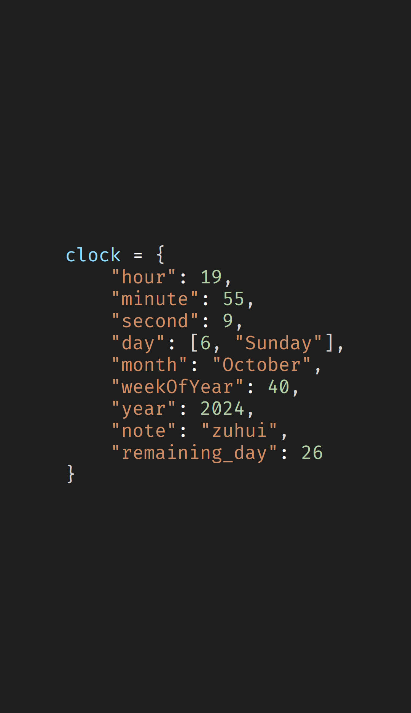

# web-based wallpaper for clock and countdown
This repository is aimed to host a wallpaper to display time and countdown **via Wallpaper Engine**.

* **Lightweight** Only javascript scripts
* **Simple and configurable**

## Required
1. Wallpaper Engine

>[!NOTE]
>This is a fork from original work by unknown. Based the version, I added the "weekOfYear", "remaining_day" to remind the countdown before the specified day about "note"

## How to run
1. Download or git clone this repository.
2. Open this local directory via Wallpaper Engine software.

## Results
If successfuly, you would see this in your desktop.

## Star History

